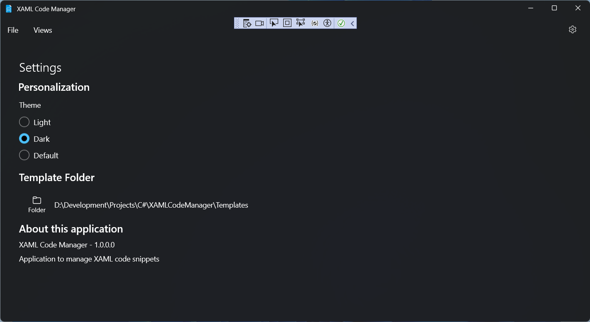
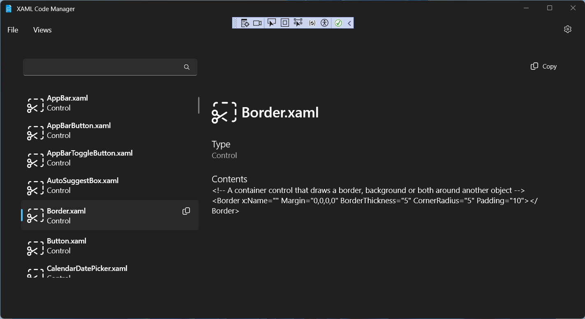
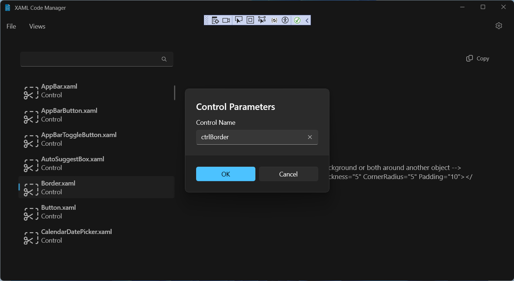

<!-- PROJECT LOGO -->
 

  

  <h3 align="center">XAMLCodeManager (v1.0)</h3>

  

     
    <a href="https://github.com/Adam-Gladstone/XAMLCodeManager"><strong>Explore the docs >></strong></a>
     
     
    <a href="https://github.com/Adam-Gladstone/XAMLCodeManager/issues">Report Bug</a>
    ·
    <a href="https://github.com/Adam-Gladstone/XAMLCodeManager/issues">Request Feature</a>
  

<!-- TABLE OF CONTENTS -->

  
Table of Contents

  <ol>
    <li>
      <a href="#about-the-project">About The Project</a>
      <ul>
        <li><a href="#built-with">Built With</a></li>
      </ul>
    </li>
    <li>
      <a href="#getting-started">Getting Started</a>
      <ul>
        <li><a href="#prerequisites">Prerequisites</a></li>
        <li><a href="#installation">Installation</a></li>
      </ul>
    </li>
    <li><a href="#usage">Usage</a></li>
    <li><a href="#roadmap">Roadmap</a></li>
    <li><a href="#license">License</a></li>
    <li><a href="#contact">Contact</a></li>
    <li><a href="#acknowledgments">Acknowledgments</a></li>
  </ol>

<!-- ABOUT THE PROJECT -->
## About The Project
__XAMLCodeManager__ is a WinUI application for managing XAML code snippets. I decided early-on not to write this as a Visual Studio add-in. I have some experience of writing Visual Studio add-ins and did not want to be tied to the Visual Studio object model or the environment (perhaps you use Visual Studio Code, or maybe Blend?).

The point of the application is to avoid (if possible) a certain amount of repetitive typing into a XAML editor. In Visual Studio, while the intellisense helps a good deal, there are still items that I find myself typing over-and-over again (`Grid.RowDefinitions`, `<StackPanel Orientation="Horizontal" />` etc.). This application provides a way to write, organise, and inject code snippets in a simple way.

(<a href="#readme-top">back to top</a>)

### Built With

* Visual Studio 2022
* C# (.NET8.0)

The following packages are used:
- CommunityToolkit.Mvvm	8.3.2
- CommunityToolkit.WinUI.UI.Controls.Primitives	8.1.240916
- Microsoft.Extensions.Hosting	9.0.0
- Microsoft.WindowsAppSDK	1.6.240923002
- Microsoft.Xaml.Behaviors.WinUI.Managed	2.09
- WinUIEx	2.4.2
- NewtonsoftJson  13.03
- coverlet.collector 6.0.2
- Microsoft.NET.Test.Sdk 17.11.1
- MSTest.TestAdapter 3.6.3
- MSTest.TestFramework 3.6.3

(<a href="#readme-top">back to top</a>)

<!-- GETTING STARTED -->
## Getting Started
The project can be downloaded from the GitHub repository in the usual way.

The solution consists of four projects:

- CodeManager: this is the main UI
- CodeManager.Core: this defines the (XAML template) model and the (XAML template) data services
- CodeManager.Tests.MSTest: test suite for the core functionality
- FileUtility: utility console application for generating XAML code snippet files

The CodeManager solution was generated using the Windows Community Toolkit template. The main components that were selected are the menu bar (for navigation), MVVM for the overall architecture, and a settings page.

The design with a (master) list view in the left hand pane and a details view on the right is taken from the excellent article *"Building a Master-Detail page with WinUI 3 and MVVM"* on **XAML Brewer** (https://xamlbrewer.wordpress.com/2022/02/07/building-a-master-detail-page-with-winui-3-and-mvvm/).

### Prerequisites

### Installation

(<a href="#readme-top">back to top</a>)

<!-- USAGE EXAMPLES -->
## Usage
On first starting the application, the list of XAML code snippets ('templates') will be empty.
Use the settings button on the right-hand side of the menu bar to select a __Template_Folder__ containing the XAML templates.

Along the way, you can personalize the Theme (Light/Dark) and view information about the application.

Once you have selected a folder, press the menu Views > Code Templates. 
The list view will be populated with the available XAML template code snippets. The list can be searched/filtered in the usual way.

On selecting a code snippet (e.g. Border.xaml), the right-hand side displays the XAML contents of the file. Additionally, the Copy button (both on the item, and on the command bar, become available).

Either double-click the selected item, or press the Copy button. This will invoke a dialog box requesting a name for the selected item. Add a name for the item and press ok.

The content is now ready to be pasted into the XAML editor with the desired name. Additional attributes can be added as usual.

`<!-- A container control that draws a border, background or both around another object -->
<Border x:Name="ctrlBorder" Margin="0,0,0,0" BorderThickness="5" CornerRadius="5" Padding="10"></Border>
`

If you don't need or want to name the XAML control (maybe you do not reference it in the code-behind class), you can simply drag the code snippet from the list and drop it into your editor.

The XAML code snippets can be added to and extended in an obvious way: e.g. you can have different stack panels for 'horizontal' and 'vertical', different sized grids, and so on.

(<a href="#readme-top">back to top</a>)

<!-- ROADMAP -->
## Roadmap

Future directions:

See the [open issues](https://github.com/Adam-Gladstone/XAMLCodeManager/issues) for a full list of proposed features (and known issues).

(<a href="#readme-top">back to top</a>)

<!-- LICENSE -->
## License

Distributed under the GPL-3.0 License. See `LICENSE.md` for more information.

(<a href="#readme-top">back to top</a>)

<!-- CONTACT -->
## Contact

Adam Gladstone - (https://www.linkedin.com/in/adam-gladstone-b6458b156/)

Project Link: [https://github.com/Adam-Gladstone/XAMLCodeManager](https://github.com/Adam-Gladstone/XAMLCodeManager)

(<a href="#readme-top">back to top</a>)

<!-- ACKNOWLEDGMENTS -->
## Acknowledgments

Helpful resources

* [Choose an Open Source License](https://choosealicense.com)
* [GitHub Pages](https://pages.github.com)
* [Font Awesome](https://fontawesome.com)
* [React Icons](https://react-icons.github.io/react-icons/search)

(<a href="#readme-top">back to top</a>)

<!-- PROJECT SHIELDS -->

[![Issues][issues-shield]][issues-url]
[![GPL-3 License][license-shield]][license-url]
[![LinkedIn][linkedin-shield]][linkedin-url]

<!-- MARKDOWN LINKS & IMAGES -->
<!-- https://www.markdownguide.org/basic-syntax/#reference-style-links -->

[issues-shield]: https://img.shields.io/github/issues/Adam-Gladstone/XAMLCodeManager.svg?style=for-the-badge
[issues-url]: https://github.com/Adam-Gladstone/XAMLCodeManager/issues

[license-shield]: https://img.shields.io/github/license/Adam-Gladstone/XAMLCodeManager.svg?style=for-the-badge
[license-url]: https://github.com/Adam-Gladstone/XAMLCodeManager/LICENSE.md

[linkedin-shield]: https://img.shields.io/badge/-LinkedIn-black.svg?style=for-the-badge&logo=linkedin&colorB=555
[linkedin-url]: https://www.linkedin.com/in/adam-gladstone-b6458b156/
                      

